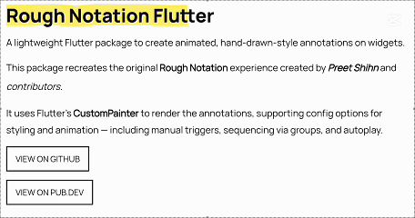

# RoughNotation Flutter

A lightweight Flutter package to create animated, hand-drawn-style annotations on widgets.

This package recreates the original [Rough Notation](https://github.com/pshihn/rough-notation) experience created by [Preet Shihn](https://twitter.com/preetster) and the [contributors](https://github.com/rough-stuff/rough-notation/graphs/contributors).

It uses Flutter’s **CustomPainter** to render the annotations, supporting config options for styling and animation — including manual triggers, sequencing via groups, and autoplay.




---

## 🌐 Playground

See the landing page which has the complete showcase:
👉 [roughnotation-flutter.web.app](https://roughnotation-flutter.web.app)

It showcases all use cases, animation types, groupings, styling controls, and more — all built with Flutter Web.

Explore source in the `playground/` folder.

---

## ✨ Features

- Hand-drawn-style annotations
- Built-in styles:
  - Underline
  - Box
  - Circle
  - Highlight
  - Strike-through
  - Crossed-off
  - Bracket
- Supports:
  - Autoplay animation
  - Manual triggers
  - Group-based sequencing
  - `WidgetSpan` for rich text use

---

## 📦 Installation

```bash
flutter pub add rough_notation
```

---

## 🚀 Usage

### Basic Annotation

```dart
RoughUnderlineAnnotation(
  child: Text('Flutter is fun!'),
)
```

### With Controller (Manual Trigger)

```dart
final controller = RoughAnnotationController();

RoughBoxAnnotation(
  controller: controller,
  child: Text('Boxed text'),
);

// Manually trigger
controller.show();
```

---

## 🧹 RichText with `WidgetSpan`

```dart
SelectableText.rich(
  TextSpan(
    text: 'Create a ',
    children: [
      WidgetSpan(
        alignment: PlaceholderAlignment.baseline,
        baseline: TextBaseline.alphabetic,
        child: RoughUnderlineAnnotation(
          child: Text('underline'),
        ),
      ),
      TextSpan(text: ' on a span.'),
    ],
  ),
);
```

---

## 🔄 Grouped Annotations

Use `group` and `sequence` to define a group and control animation order.

```dart
RoughUnderlineAnnotation(
  group: 'intro',
  sequence: 1,
  child: Text('Step 1'),
);

RoughBoxAnnotation(
  group: 'intro',
  sequence: 2,
  child: Text('Step 2'),
);

// Trigger animation
RoughAnnotationRegistry.showGroup('intro');
```

### Autoplay a Group on Widget Init

```dart
@override
void initState() {
  super.initState();
  RoughAnnotationRegistry.markGroupForAutoStart('groupName');
}
```

#### ✅ Note:
- It doesn't matter **where** widgets are in the widget tree — grouped annotations can live inside deeply nested widgets or even different build scopes. The registry handles sequencing regardless of position.
- From Flutter 3.16+, deferred or conditionally built widgets (e.g., in a `ListView.builder`) won’t throw errors but will skip animations until built.

Optional:

```dart
RoughAnnotationRegistry.showGroup(
  'intro',
  delayBetween: Duration(milliseconds: 300),
);
```

---

## ⚠️ Potential Pitfalls & Edge Cases

- **Delays & Durations:** Group sequencing introduces its own delays between elements. Avoid adding large `delay` values on individual annotations if part of a group.
- **Controllers & Autoplay:** If using `RoughAnnotationController(autoPlay: true)`, ensure the widget is built first. Internally, we use `addPostFrameCallback` to delay the trigger.
- **Multiple Controllers:** You can reuse the same controller for multiple widgets, but only one annotation may render if others haven't mounted yet.
- **Lazy Lists / Builders:** Widgets in a `ListView.builder` or similar builders that are not yet mounted will not animate. No crash, but no effect either.
- **Visual Misalignments:** Styling mismatches may occur across platforms. Future updates will improve drawing precision and painter logic.

---

## 🧠 What's Next

We’re aiming to improve:

- Core painter logic for smoother lines and curves (`lib/src/painters`)
- Extend features and stability of annotation widgets (`lib/src/annotations`)
- Also the controllers & grouped behaviour (`lib/src/controllers`)

> The original JS library uses [roughjs](https://roughjs.com/). Although there's a Flutter version (`rough`), it’s outdated and Dart 3 incompatible.

We’re considering reviving or reimplementing it in parts. All contributions are welcome!

If you're looking to contribute, ideal places to start are:

- `lib/src/painters/`
- `lib/src/annotations/`

---

## 🙏❤️ Acknowledgements

This Flutter package is heavily inspired by the original [Rough Notation JS library](https://github.com/pshihn/rough-notation).

We acknowledge the original creators and contributors of the JS library — including design, animation logic, and documentation. 

We are grateful for the coder’s community and the support of open-source enthusiasts everywhere.

---

## 📄 License

MIT

---

## 🤝 Contributions

Pull requests are welcome. Let’s make annotations ✏️ in Flutter fun and beautiful.
